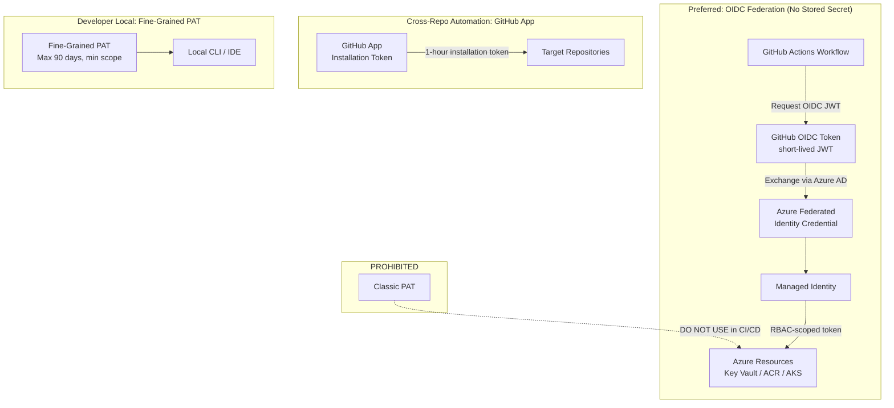

# ADR-204001: GitHub PATs and Tokens Management

| Field | Value |
|---|---|
| **ID** | ADR-204001 |
| **Status** | Accepted |
| **Provider** | Microsoft Azure |
| **Discipline** | Security |
| **Replaces** | ADF-014 |
| **Date** | 2026-06-17 |

---

## Context

GitHub Personal Access Tokens (PATs) are long-lived, high-privilege credentials that provide broad access to repositories, packages, and organization resources. When used in CI/CD pipelines and stored in repository secrets or environment variables, they represent a persistent risk: token leakage, over-scoping, and absence of rotation policies have been root causes of numerous supply chain compromises.

The GitHub token ecosystem has evolved significantly — fine-grained PATs, GitHub Apps, and OIDC federation with external identity providers now provide more precise and safer alternatives to classic PATs.

---

## Decision

We will standardize on the following token hierarchy, in order of preference:

1. **GitHub Actions OIDC → Azure Workload Identity Federation** — preferred for all Azure resource access from pipelines; no stored secret, short-lived JWT
2. **GitHub Apps (installation tokens)** — for cross-repo automation requiring organization-level access
3. **Fine-grained PATs** with minimum scope and 90-day maximum expiry — for human developer use only
4. **Classic PATs are prohibited** in all CI/CD contexts

All tokens and secrets stored in GitHub must be tracked in the organization’s secret inventory (managed per [[ADR-204002]]).

---

## Drivers

- Eliminate long-lived stored credentials from CI/CD pipelines
- Enforce minimum-privilege on all token scopes
- Comply with SOC 2 CC6.1 (logical access controls) and CC6.2 (credential management)
- Provide audit trail for all token issuance and usage

## Alternatives Considered

| Alternative | Pros | Cons | Reason Rejected |
|---|---|---|---|
| Classic PATs everywhere | Simple, universal support | Broad scope, long-lived, no per-repo granularity, no expiry enforcement | High risk — prohibited |
| Service Account with classic PAT | Shared identity for automation | Single point of compromise; secret rotation blocks all dependent pipelines | Rejected — use GitHub Apps instead |
| Fine-grained PATs for CI/CD | Scoped to specific repos | Still a stored secret; requires rotation; human error risk | Acceptable only for developer use, not pipelines |

---

## Architecture

---

## Token Reference

| Token Type | Use Case | Max Lifetime | CI/CD Allowed | Secret Stored |
|---|---|---|---|---|
| OIDC (GitHub → Azure) | Azure resource access from Actions | 5 minutes | ✅ Preferred | No |
| GitHub App Installation Token | Cross-repo automation | 1 hour | ✅ Allowed | No (generated on demand) |
| Fine-grained PAT | Developer local access | 90 days | ⚠️ Dev only | Yes (Key Vault) |
| Classic PAT | Legacy integrations | Up to 1 year | ❌ Prohibited | — |

---

## Consequences

### Positive
- OIDC eliminates stored long-lived credentials from GitHub secrets entirely
- Fine-grained PATs limit blast radius: compromise of one token cannot access other repos
- Centralized inventory enables rotation auditing and automated expiry alerting

### Negative / Trade-offs
- OIDC setup requires Azure AD app registration + federated credential configuration per workflow
- GitHub Apps require organization admin approval for installation
- Migration from classic PATs creates temporary developer friction

### Risks
- OIDC subject claim misconfiguration (e.g., `repo:*` instead of specific branch/environment) over-authorizes pipelines — validate subject claims in federated credential configuration
- Fine-grained PAT expiry without rotation causes developer pipeline failures — alert 14 days before expiry via GitHub API
- Classic PATs already in use must be audited and revoked — run `gh auth list` across org and rotate

---

## Implementation Notes

- OIDC: `azurerm_user_assigned_identity` + `azurerm_federated_identity_credential` with subject claim `repo:<org>/<repo>:ref:refs/heads/main`
- GitHub Actions: `permissions: id-token: write` + `azure/login@v2` action with `client-id`, `tenant-id`, `subscription-id`
- PAT inventory: maintain in Azure Key Vault with expiry tags; automate alerting via Key Vault expiry events
- Related: [[ADR-204002]] (Bootstrap Secret Flow), [[ADR-204003]] (Enterprise App Identity)

---

## References

- [GitHub OIDC with Azure](https://docs.github.com/en/actions/security-for-github-actions/security-hardening-your-deployments/configuring-openid-connect-in-azure)
- [Fine-grained PATs](https://docs.github.com/en/authentication/keeping-your-account-and-data-secure/managing-your-personal-access-tokens)
- [GitHub Apps documentation](https://docs.github.com/en/apps/creating-github-apps/about-creating-github-apps/about-creating-github-apps)
