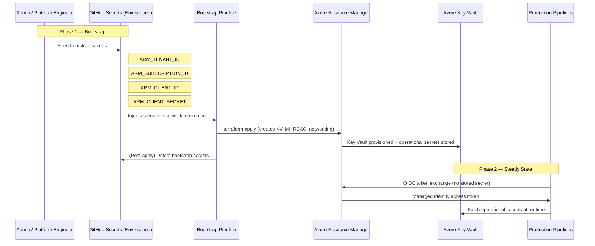

# ADR-204002: GitHub and Azure Bootstrap Secret Variable Flow

| Field | Value |
|---|---|
| **ID** | ADR-204002 |
| **Status** | Accepted |
| **Provider** | Microsoft Azure |
| **Discipline** | Security |
| **Replaces** | ADF-015 |
| **Date** | 2026-06-17 |

---

## Context

The bootstrap phase of infrastructure provisioning — before Managed Identity and Key Vault are fully established — requires a small set of "chicken-and-egg" credentials to exist somewhere accessible to CI/CD pipelines. These bootstrap secrets (subscription ID, tenant ID, initial service principal credentials) must be securely seeded without being hardcoded in source or visible in pipeline logs.

Post-bootstrap, all runtime secrets should flow from Azure Key Vault into pipelines via Managed Identity, making GitHub-stored secrets a transient bootstrap artifact that should be deleted once provisioning is complete.

---

## Decision

We will implement a **two-phase secret lifecycle**:

**Phase 1 — Bootstrap:** Minimal secrets stored as GitHub Actions encrypted secrets (environment-scoped). Used exclusively during infrastructure initialization (Terraform `init` + first `apply`).

**Phase 2 — Steady State:** All runtime secrets fetched from Azure Key Vault via OIDC Managed Identity. GitHub secrets are deprecated and deleted post-bootstrap. No long-lived credentials remain in GitHub.

---

## Drivers

- Resolve chicken-and-egg dependency: must provision Key Vault before Key Vault can store secrets
- Minimize GitHub secrets surface to the absolute minimum required for bootstrap
- Enforce environment-scoped secrets to prevent cross-environment leakage
- Provide clear operational runbook for reprovisioning from scratch

## Alternatives Considered

| Alternative | Pros | Cons | Reason Rejected |
|---|---|---|---|
| Hardcode bootstrap values in Terraform | Simple | Credentials in source code — critical security violation | Non-starter |
| Use existing Key Vault in another subscription | Avoids bootstrap problem | Cross-subscription dependency creates coupling; unavailable for greenfield deployments | Not universally applicable |
| HashiCorp Vault as external secret store | Powerful, cloud-agnostic | Requires its own bootstrapping and HA infrastructure | Excessive complexity for Azure-native workloads |

---

## Architecture

---

## Secret Inventory

| Secret Name | Phase | Location | Rotation Period | Notes |
|---|---|---|---|---|
| `ARM_TENANT_ID` | Bootstrap only | GitHub Environment Secret | One-time | Non-sensitive; public tenant ID |
| `ARM_SUBSCRIPTION_ID` | Bootstrap only | GitHub Environment Secret | One-time | Non-sensitive; public subscription ID |
| `ARM_CLIENT_ID` | Bootstrap only | GitHub Environment Secret | 90 days | Bootstrap service principal app ID |
| `ARM_CLIENT_SECRET` | Bootstrap only | GitHub Environment Secret | 90 days | **Delete after bootstrap completes** |
| All operational secrets | Steady state | Azure Key Vault | Per policy | Managed Identity access only |

---

## Consequences

### Positive
- GitHub secrets surface reduced to 4 bootstrap-phase secrets, deleted post-provisioning
- Key Vault becomes the single source of truth for all operational secrets
- Environment-scoped secrets in GitHub prevent dev/staging/prod cross-contamination
- Bootstrap process is documented and reproducible for disaster recovery scenarios

### Negative / Trade-offs
- Bootstrap must be carefully sequenced — out-of-order execution (e.g., running app pipeline before KV is provisioned) fails explicitly
- GitHub environment secret management requires org-level admin access for initial configuration
- Bootstrap service principal must have sufficient RBAC to create Key Vault, Managed Identity, and RBAC assignments (Contributor + User Access Administrator on subscription scope during bootstrap)

### Risks
- Bootstrap secrets left in GitHub beyond the provisioning window — automate deletion in post-`terraform apply` pipeline step
- Key Vault soft-delete means "deleted" secrets remain recoverable for 90 days — enable purge protection for compliance
- Bootstrap service principal with broad RBAC represents a temporary elevated privilege risk — delete SP after bootstrap, replace with Managed Identity

---

## Implementation Notes

- GitHub Actions: use `environment: bootstrap` with required reviewers gate for the bootstrap workflow
- Post-bootstrap cleanup step: `gh secret delete ARM_CLIENT_SECRET --env bootstrap`
- Terraform state: store in Azure Storage Account (also provisioned in bootstrap) with Managed Identity access post-bootstrap
- Related: [[ADR-204001]] (Token types), [[ADR-204003]] (Enterprise App Identity)

---

## References

- [GitHub encrypted secrets](https://docs.github.com/en/actions/security-for-github-actions/security-guides/using-secrets-in-github-actions)
- [Azure Key Vault soft-delete and purge protection](https://learn.microsoft.com/en-us/azure/key-vault/general/soft-delete-overview)
- [Terraform Azure backend configuration](https://developer.hashicorp.com/terraform/language/backend/azurerm)
