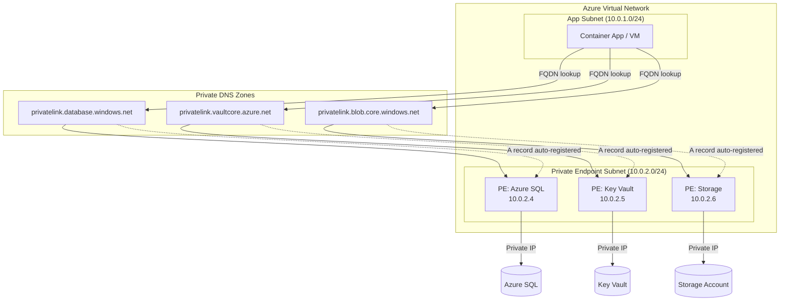

# ADR-205001: Private PaaS Connectivity and DNS

| Field | Value |
|---|---|
| **ID** | ADR-205001 |
| **Status** | Accepted |
| **Provider** | Microsoft Azure |
| **Discipline** | Networking |
| **Replaces** | ADF-007 |
| **Date** | 2026-06-17 |

---

## Context

Azure PaaS services (Azure SQL, Storage, Key Vault, Service Bus, etc.) are publicly accessible by default via their `*.windows.net` / `*.azure.com` FQDNs. In enterprise architectures requiring network isolation, this creates an unacceptable attack surface: data-plane traffic traverses the public internet, and there is no mechanism to enforce private-only access through traditional network controls.

Additionally, split-horizon DNS resolution is required so that workloads inside the virtual network resolve PaaS FQDNs to their private IP addresses, while external clients continue to resolve to public endpoints (or are blocked entirely).

---

## Decision

We will use **Azure Private Endpoints** combined with **Azure Private DNS Zones** to route all PaaS data-plane traffic over the private network fabric. Public network access will be disabled at the resource level wherever the service supports it.

---

## Drivers

- Zero-trust network posture: no PaaS data-plane traffic over the public internet
- Compliance requirements (SOC 2, ISO 27001) mandating private connectivity
- Elimination of IP-based firewall rules as the primary access control mechanism
- Consistent DNS resolution for both on-premises and Azure-hosted workloads via ExpressRoute/VPN

## Alternatives Considered

| Alternative | Pros | Cons | Reason Rejected |
|---|---|---|---|
| Service Endpoints | Lower cost, simpler setup | Still routes over Azure backbone (not fully private), no DNS isolation | Insufficient for zero-trust posture |
| IP Firewall Rules on PaaS | Familiar pattern | Brittle, IP range management overhead, doesn’t prevent exfiltration | Operationally expensive, not scalable |
| VNet Injection (App Service) | Full network integration | Only available for select services, higher cost SKU requirements | Limited applicability |

---

## Architecture

---

## Consequences

### Positive
- All PaaS data-plane traffic remains within the Azure backbone / private IP space
- `publicNetworkAccess: Disabled` removes the entire public attack surface
- Private DNS zones auto-register NIC IPs, reducing manual DNS record management
- Consistent resolution for on-premises clients tunneled through ExpressRoute/VPN

### Negative / Trade-offs
- Additional cost per private endpoint NIC (~$7–10/month per endpoint)
- DNS zone linking must be maintained as VNets grow; missing links cause resolution failures
- Increases provisioning complexity — Terraform/Bicep modules must orchestrate PE + DNS zone + VNet link atomically

### Risks
- DNS misconfiguration can silently fall back to public resolution — monitor with Azure Policy `Deny` on public access
- Private endpoints are regional; multi-region deployments require DNS zone replication strategy

---

## Implementation Notes

- Deploy via Terraform module with `azurerm_private_endpoint` + `azurerm_private_dns_zone_virtual_network_link`
- Enable Azure Policy initiative `Deny Public Network Access` for all applicable PaaS SKUs
- Validate with `nslookup <fqdn>` from within the VNet — must resolve to `10.x.x.x` private IP
- See [[ADR-205003]] for automated Private Endpoint approval workflow

---

## References

- [Azure Private Endpoint documentation](https://learn.microsoft.com/en-us/azure/private-link/private-endpoint-overview)
- [Private DNS Zone integration](https://learn.microsoft.com/en-us/azure/private-link/private-endpoint-dns)
