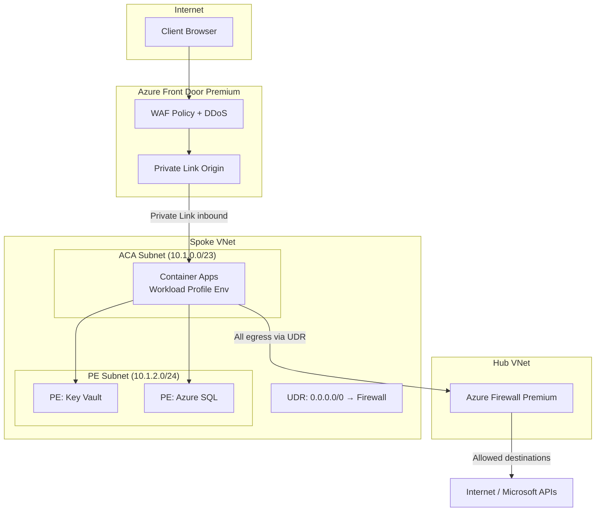

# ADR-205002: Container Apps Workload Profile for Private Origin

| Field | Value |
|---|---|
| **ID** | ADR-205002 |
| **Status** | Accepted |
| **Provider** | Microsoft Azure |
| **Discipline** | Networking |
| **Replaces** | ADF-008 |
| **Date** | 2026-06-17 |

---

## Context

Azure Container Apps (ACA) environments operate in two modes: **Consumption-only** (shared, Microsoft-managed infrastructure) and **Workload Profiles** (dedicated infrastructure with VNet injection). For workloads that require private egress, access to Private Endpoints, and origin protection behind Azure Front Door, the Consumption-only environment is insufficient — it lacks the network control plane required to route traffic through hub firewalls or reach private PaaS endpoints.

Enterprise workloads handling sensitive data or subject to compliance mandates must run in a VNet-injected environment to participate in the hub-and-spoke network topology.

---

## Decision

We will deploy Azure Container Apps using **Workload Profile environments** with VNet injection into a dedicated subnet. This enables:

1. Inbound traffic exclusively via Azure Front Door Private Link origin (no public ingress)
2. Outbound traffic routed through Azure Firewall via UDR for egress inspection
3. Access to Private Endpoints for PaaS services (Key Vault, SQL, Storage)
4. Internal DNS resolution via Private DNS Zones linked to the VNet

---

## Drivers

- Private origin requirement for Azure Front Door Premium ([[ADR-205005]])
- Egress inspection via Azure Firewall ([[ADR-205007]])
- Access to VNet-resident Private Endpoints ([[ADR-205001]])
- Workload isolation from shared multi-tenant infrastructure

## Alternatives Considered

| Alternative | Pros | Cons | Reason Rejected |
|---|---|---|---|
| Consumption-only ACA | Lower cost, zero infrastructure management | No VNet injection, no Private Link origin support, shared egress IP | Cannot meet network isolation requirements |
| Azure Kubernetes Service (AKS) | Maximum control | Significantly higher operational overhead, requires cluster management | Disproportionate complexity for containerized apps |
| App Service (VNet Integration) | Mature, well-documented | Outbound-only VNet integration; inbound still requires public IP or ASE (expensive) | App Service Environment cost is prohibitive |

---

## Architecture

---

## Subnet Sizing

| Resource | Recommended CIDR | Minimum Size | Notes |
|---|---|---|---|
| ACA Workload Profile subnet | `/23` (512 IPs) | `/27` (32 IPs) | ACA reserves IPs for internal infrastructure; size generously |
| Private Endpoint subnet | `/24` (256 IPs) | `/28` (16 IPs) | One IP per PE NIC |
| Azure Firewall subnet | `/26` (64 IPs) | `/26` | Required minimum by Azure |

---

## Consequences

### Positive
- Container Apps participate fully in hub-and-spoke topology
- Private Link origin eliminates any direct internet path to the application
- Dedicated compute via Workload Profile enables predictable performance and scaling
- Egress IP is deterministic (Firewall public IP) — simplifies third-party allowlisting

### Negative / Trade-offs
- Workload Profile environments have higher baseline cost vs. Consumption-only (~$0.25/vCPU-hour dedicated)
- Subnet delegation to `Microsoft.App/environments` is exclusive — no other resources can share the subnet
- Minimum subnet size `/27` is undersized in practice; `/23` recommended for production

### Risks
- ACA subnet IP exhaustion during scale-out — monitor available IPs with Azure Monitor metric alerts
- UDR misconfiguration causes asymmetric routing — validate all spokes have default route to hub before go-live

---

## Implementation Notes

- Terraform: `azurerm_container_app_environment` with `infrastructure_subnet_id` and `internal_load_balancer_enabled = true`
- AFD Private Link origin type: `Microsoft.App/managedEnvironments`
- Related ADRs: [[ADR-205001]] (Private Endpoints), [[ADR-205003]] (PE Approval), [[ADR-205005]] (AFD Edge), [[ADR-205007]] (Egress Inspection)

---

## References

- [ACA Workload profiles overview](https://learn.microsoft.com/en-us/azure/container-apps/workload-profiles-overview)
- [ACA with VNet integration](https://learn.microsoft.com/en-us/azure/container-apps/vnet-custom)
- [AFD Private Link with Container Apps](https://learn.microsoft.com/en-us/azure/frontdoor/private-link)
