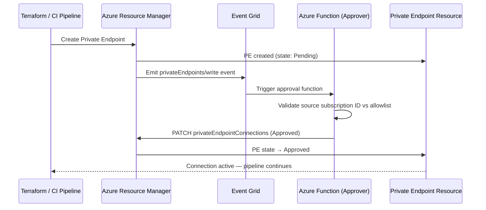

# ADR-205003: Private Endpoint Approval Automation

| Field | Value |
|---|---|
| **ID** | ADR-205003 |
| **Status** | Accepted |
| **Provider** | Microsoft Azure |
| **Discipline** | Networking |
| **Replaces** | ADF-009 |
| **Date** | 2026-06-17 |

---

## Context

When Private Endpoints are created targeting resources that require manual approval (e.g., cross-subscription, cross-tenant, or policy-enforced approval workflows), the connection enters a `Pending` state. Without automation, this creates operational toil — a human must log into the portal or run CLI commands to approve each connection before traffic can flow.

At scale (dozens of microservices, multiple environments), manual approval becomes a release blocker and a source of deployment failures in CI/CD pipelines.

---

## Decision

We will implement **automated Private Endpoint connection approval** using Azure Event Grid + Azure Functions triggered on `Microsoft.Network/privateEndpoints/write` events, combined with an allowlist of approved subscription IDs to enforce authorization policy programmatically.

---

## Drivers

- Eliminate human-in-the-loop bottleneck in CI/CD pipelines
- Enforce approval policy programmatically (allowlist of approved subscription IDs)
- Maintain a full audit trail of all approvals via Function App logs + Azure Monitor
- Support cross-subscription topologies without manual coordination

## Alternatives Considered

| Alternative | Pros | Cons | Reason Rejected |
|---|---|---|---|
| Manual portal approval | Simple | Blocks pipelines, not scalable | Rejected — operational bottleneck |
| Auto-approve all (policy disabled) | Zero friction | Security risk — any PE can connect | Rejected — violates zero-trust |
| ARM Deployment Scripts | Synchronous, no extra infra | Tightly coupled to deployment, complex error handling | Suitable only for small/simple environments |

---

## Architecture

---

## Consequences

### Positive
- CI/CD pipelines complete without manual intervention
- Approval logic is codified and version-controlled — allowlisted subscriptions only
- All approvals are logged with timestamp, subscription ID, and PE resource ID
- Idempotent function design handles Event Grid at-least-once delivery safely

### Negative / Trade-offs
- Function App cold start can introduce 10–30 second delay before approval fires
- Adds infrastructure components (Function App, Event Grid subscription, Managed Identity with RBAC)
- Event Grid subscription must be scoped correctly — too broad causes noise; too narrow misses events

### Risks
- Overly permissive allowlist allows rogue PE connections from unauthorized subscriptions
- Function App outage leaves PEs in `Pending` state indefinitely — alert on `Pending` connections > 5 minutes
- Event Grid delivery failures (dead-letter queue) must be monitored

---

## Implementation Notes

- Function App uses System-Assigned Managed Identity with `Microsoft.Network/privateEndpoints/privateEndpointConnections/write` RBAC on target resources
- Allowlist stored in Azure App Configuration or Key Vault secret (not hardcoded)
- Terraform: `azurerm_eventgrid_event_subscription` scoped to the resource group of protected resources
- Related: [[ADR-205001]] for PE + DNS baseline pattern

---

## References

- [Private Endpoint connection management](https://learn.microsoft.com/en-us/azure/private-link/manage-private-endpoint)
- [Event Grid system topics for Azure resources](https://learn.microsoft.com/en-us/azure/event-grid/system-topics)
- [Azure Functions with Event Grid trigger](https://learn.microsoft.com/en-us/azure/azure-functions/functions-bindings-event-grid-trigger)
