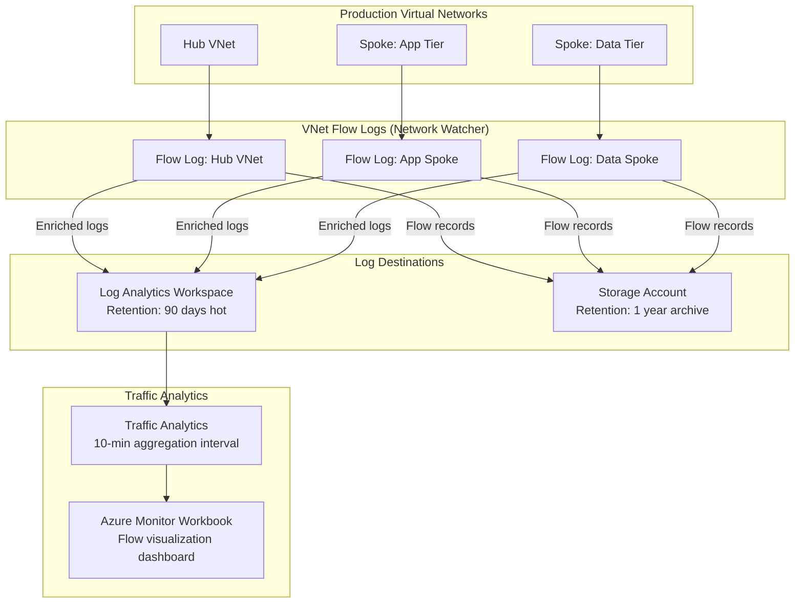

# ADR-205004: Virtual Network Flow Logs

| Field | Value |
|---|---|
| **ID** | ADR-205004 |
| **Status** | Accepted |
| **Provider** | Microsoft Azure |
| **Discipline** | Networking |
| **Replaces** | ADF-010 |
| **Date** | 2026-06-17 |

---

## Context

Network visibility is foundational to both security operations (detecting lateral movement, exfiltration attempts) and operational troubleshooting (diagnosing connectivity failures, identifying misconfigured NSG rules). Without flow logs, teams are blind to the actual traffic traversing the network — Azure Policy and NSG rules can be in place, but there is no way to verify they are working as intended or detect violations after the fact.

VNet Flow Logs (the successor to NSG Flow Logs) provide per-flow telemetry at the virtual network level, capturing source/destination IP, port, protocol, and allow/deny decisions.

---

## Decision

We will enable **VNet Flow Logs** on all production virtual networks, with logs shipped to a **Log Analytics Workspace** for querying and retention, and to a **Storage Account** for long-term archive and compliance. Traffic Analytics will be enabled to surface aggregated insights and anomaly detection.

---

## Drivers

- Security operations requirement: visibility into all network flows for incident response
- Compliance mandates (SOC 2 CC6.6, PCI DSS Req 10): network traffic logging and retention
- Operational troubleshooting: diagnose NSG rule gaps and routing issues
- Validate east-west segmentation policy ([[ADR-205006]]) is enforced as expected

## Alternatives Considered

| Alternative | Pros | Cons | Reason Rejected |
|---|---|---|---|
| NSG Flow Logs (legacy) | Well-established, widely documented | Deprecated in favor of VNet Flow Logs; per-NSG scope creates gaps | Replaced by VNet Flow Logs |
| Azure Firewall logs only | Rich FQDN/application-level detail | Only captures traffic routed through firewall; misses direct subnet-to-subnet flows | Incomplete coverage |
| Packet capture (Network Watcher) | Full packet-level detail | Point-in-time only, high storage cost, not suitable for continuous monitoring | Complementary tool, not a replacement |

---

## Architecture



---

## Retention Policy

| Destination | Retention | Purpose |
|---|---|---|
| Log Analytics Workspace | 90 days (hot) | Live querying, incident response, Traffic Analytics |
| Storage Account (Cool tier) | 365 days | Compliance archive, long-term forensics |
| Storage Account (Archive tier) | 7 years | Regulatory retention (if applicable) |

---

## Consequences

### Positive
- Full network flow visibility across all production VNets
- Traffic Analytics provides geo-visualization of flows and top-talker identification
- Log Analytics enables KQL queries for incident response (e.g., “show all flows to port 22 from external IPs”)
- Flow logs confirm NSG segmentation rules ([[ADR-205006]]) are working as designed

### Negative / Trade-offs
- Storage costs for flow log data can be significant in high-traffic environments (~$0.05/GB ingest to LA)
- 10-minute Traffic Analytics aggregation interval means near-real-time, not real-time
- VNet Flow Logs require Network Watcher enabled per region — enforce via Azure Policy

### Risks
- High-volume environments may generate excessive log data — implement sampling rate tuning if cost becomes prohibitive
- Logs stored in Storage Account must have immutability policies enabled to satisfy tamper-evident compliance requirements

---

## Implementation Notes

- Terraform: `azurerm_network_watcher_flow_log` with `traffic_analytics` block
- Azure Policy: `Deploy VNet flow logs should be enabled` — assign at subscription scope
- KQL starter query for denied flows:
  ```kql
  AzureNetworkAnalytics_CL
  | where FlowStatus_s == "D"
  | summarize count() by SrcIP_s, DestIP_s, DestPort_d
  | order by count_ desc
  ```
- Related: [[ADR-205006]] (East-West Segmentation), [[ADR-205007]] (Egress Inspection)

---

## References

- [VNet Flow Logs overview](https://learn.microsoft.com/en-us/azure/network-watcher/vnet-flow-logs-overview)
- [Traffic Analytics documentation](https://learn.microsoft.com/en-us/azure/network-watcher/traffic-analytics)
