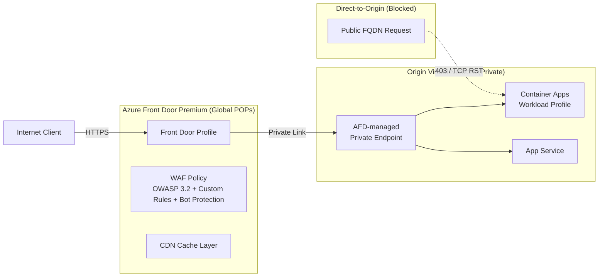

# ADR-205005: Edge Ingress and Origin Protection

| Field | Value |
|---|---|
| **ID** | ADR-205005 |
| **Status** | Accepted |
| **Provider** | Microsoft Azure |
| **Discipline** | Networking |
| **Replaces** | ADF-011 |
| **Date** | 2026-06-17 |

---

## Context

Internet-facing workloads require protection against DDoS, bot abuse, OWASP Top 10 vulnerabilities, and direct-to-origin attacks that bypass CDN/WAF layers. A common failure mode is that WAF rules are in place at the edge but the origin (App Service, Container Apps, AKS) remains directly reachable via its public FQDN, rendering the edge layer ineffective.

Origin protection must be enforced at the network layer — not just at the policy layer — to close this bypass path entirely.

---

## Decision

We will use **Azure Front Door Premium** as the global edge layer (CDN + WAF + DDoS Standard), with origin protection enforced through:

1. **Private Link origins** — Container Apps / App Service origins receive traffic exclusively through AFD-managed Private Endpoints (no public inbound path)
2. **`X-Azure-FDID` header validation** — Application-level header check as defense-in-depth for services that cannot use Private Link
3. **IP allowlisting to AFD service tags** (`AzureFrontDoor.Backend`) as a tertiary network control

---

## Drivers

- Eliminate direct-to-origin attack vector that bypasses WAF
- DDoS Standard protection without per-VNet cost (inherited from AFD Premium)
- OWASP Top 10 and bot protection via managed WAF rule sets
- Global anycast routing for latency optimization
- Managed TLS certificates with auto-renewal

## Alternatives Considered

| Alternative | Pros | Cons | Reason Rejected |
|---|---|---|---|
| Azure Application Gateway + WAF v2 | Regional, rich routing rules, mutual TLS | Regional only — no global CDN; requires separate DDoS protection; no Private Link origin | Suitable for internal apps; not for global internet-facing workloads |
| Third-party WAF (Cloudflare, Fastly) | Advanced bot protection, edge compute | Data sovereignty concerns; increased vendor complexity; no native Azure Private Link origin support | Adds operational complexity without commensurate benefit for Azure-native workloads |
| Azure CDN (Standard) | Low cost | No WAF, no Private Link origin, no DDoS Standard | Insufficient security posture |

---

## Architecture

---

## WAF Rule Configuration

| Rule Set | Mode | Notes |
|---|---|---|
| OWASP CRS 3.2 | Prevention | Core injection, XSS, protocol anomalies |
| Microsoft Bot Manager | Prevention | Known bad bots, scrapers, scanners |
| Custom: Rate Limiting | Prevention | 100 req/min per IP on login endpoints |
| Custom: Geo-blocking | Prevention | Block regions not applicable to business |

---

## Consequences

### Positive
- Origin is unreachable from the public internet — all ingress flows through WAF inspection
- DDoS Standard protection included in AFD Premium — no per-VNet DDoS plan required
- Private Link origin removes IP allowlist maintenance burden
- Managed TLS with auto-rotation eliminates certificate expiry incidents

### Negative / Trade-offs
- AFD Premium cost is significant (~$330+/month base + data transfer)
- Private Link origin approval requires automation ([[ADR-205003]]) to avoid pipeline delays
- WebSocket and gRPC support require specific routing rule configuration in AFD

### Risks
- Header-only protection (`X-Azure-FDID`) can be spoofed by a determined attacker — must be combined with NSG/Private Link network controls
- WAF in Detection mode provides logging but no blocking — validate Prevention mode before production go-live
- False positives from OWASP rules on complex API payloads — allocate time for WAF tuning post-deployment

---

## Implementation Notes

- Terraform: `azurerm_cdn_frontdoor_profile` (SKU: `Premium_AzureFrontDoor`) + `azurerm_cdn_frontdoor_origin` with `private_link` block
- WAF policy: `azurerm_cdn_frontdoor_firewall_policy` with `Prevention` mode
- Validate origin protection: attempt direct HTTPS to origin FQDN from external IP — must return 403 or TCP RST
- Related: [[ADR-205002]] (ACA Workload Profile), [[ADR-205003]] (PE Approval Automation)

---

## References

- [Azure Front Door Premium overview](https://learn.microsoft.com/en-us/azure/frontdoor/front-door-overview)
- [Private Link origins with Front Door](https://learn.microsoft.com/en-us/azure/frontdoor/private-link)
- [WAF policy on Front Door](https://learn.microsoft.com/en-us/azure/web-application-firewall/afds/afds-overview)
