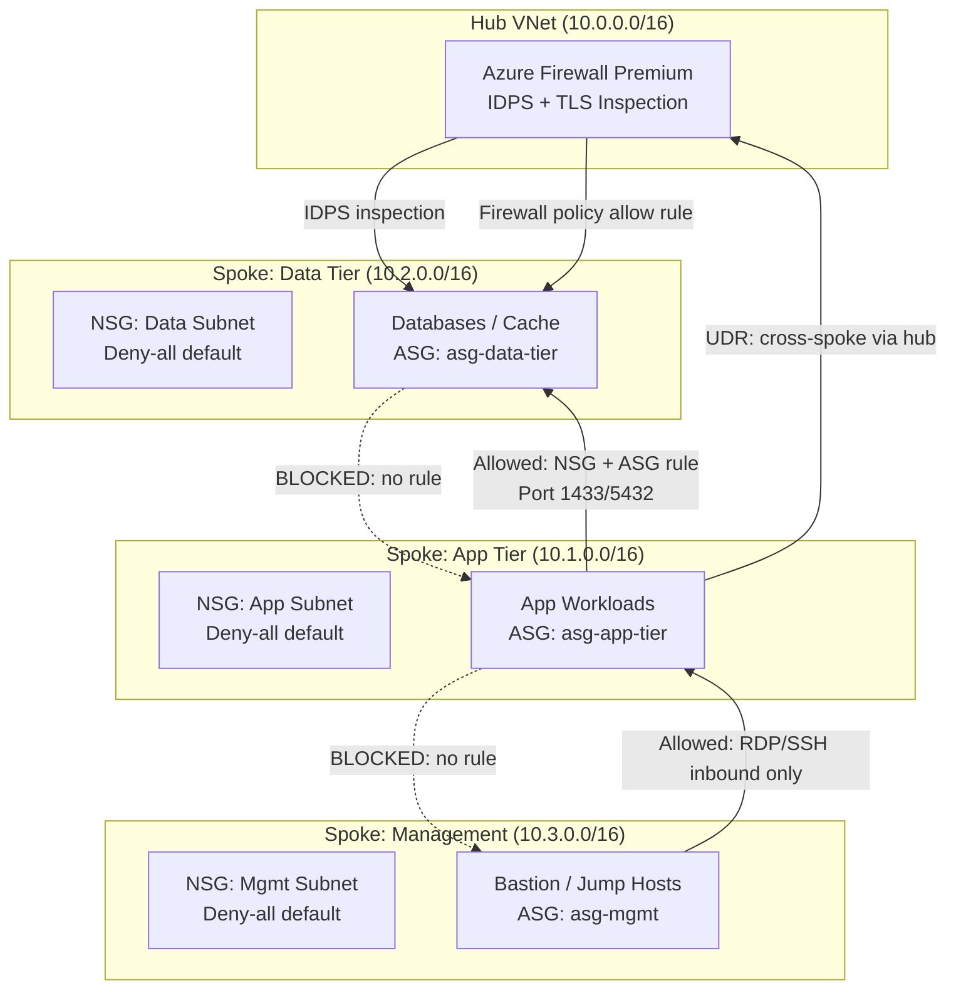

# ADR-205006: East-West Network Segmentation

| Field | Value |
|---|---|
| **ID** | ADR-205006 |
| **Status** | Accepted |
| **Provider** | Microsoft Azure |
| **Discipline** | Networking |
| **Replaces** | ADF-012 |
| **Date** | 2026-06-17 |

---

## Context

East-west traffic (lateral movement between workloads within the same VNet or across peered VNets) is a primary vector for breach escalation. Default VNet behavior allows all subnets to communicate freely, meaning a compromised workload in one subnet can reach databases, management interfaces, or other sensitive services without restriction.

Zero-trust mandates that lateral movement be explicitly authorized — all inter-workload communication is denied by default and must be explicitly permitted through policy.

---

## Decision

We will implement east-west segmentation using a layered defense model:

1. **Network Security Groups (NSGs)** applied to every subnet — deny-all default, explicit allow rules only
2. **Application Security Groups (ASGs)** for workload-centric rules that survive IP address changes during scaling
3. **Azure Firewall Premium** in the hub VNet for cross-spoke traffic inspection with IDPS signatures
4. **User Defined Routes (UDRs)** forcing all cross-spoke traffic through the hub firewall

---

## Drivers

- Contain blast radius of a compromised workload to its subnet
- Detect and block known lateral movement signatures via IDPS
- Eliminate implicit trust between subnets in the same VNet
- Provide audit log of all inter-subnet flows via [[ADR-205004]] (VNet Flow Logs)

## Alternatives Considered

| Alternative | Pros | Cons | Reason Rejected |
|---|---|---|---|
| NSGs only (no firewall) | Low cost, simple | No deep packet inspection; NSG rules don’t detect application-layer attacks | Insufficient for IDPS requirement |
| Azure Firewall only (no NSGs) | Centralized policy | Single chokepoint creates bottleneck; no subnet-level blast radius containment | Defense-in-depth requires both layers |
| Third-party NVA (Palo Alto, Fortinet) | Advanced threat detection | Higher cost, operational complexity, licensing overhead | Disproportionate for current scale |

---

## Architecture

---

## NSG Rule Design Principles

| Principle | Implementation |
|---|---|
| Deny-all default | Lowest priority (65000) `Deny` rule on every NSG |
| Allowlist by ASG | Rules reference ASGs, not IP ranges — survive scale events |
| Inbound only from known sources | App tier only accepts from AFD Private Link and Load Balancer |
| Management access via Bastion | No direct RDP/SSH from internet; Azure Bastion only |
| Separate NSG per subnet | NSGs never shared across subnets to prevent rule bleed |

---

## Consequences

### Positive
- Compromised workload contained to its subnet — cannot pivot to data tier without crossing firewall
- IDPS on Azure Firewall detects and blocks known lateral movement signatures (e.g., SMB exploits, credential harvesting)
- ASG-based rules are IP-agnostic — survive scaling events and pod restarts
- VNet Flow Logs ([[ADR-205004]]) confirm segmentation is enforced as designed

### Negative / Trade-offs
- NSG rule sprawl in large environments — enforce naming convention and tagging via Azure Policy
- Azure Firewall Premium adds cost (~$1.25/hour + data processing)
- UDR management required on every subnet to force hub inspection — missing UDR = bypass

### Risks
- Asymmetric routing (traffic enters via hub, response returns direct) breaks stateful inspection — all spokes must have default route `0.0.0.0/0` pointing to hub firewall
- New subnets provisioned without NSG or UDR create uncontrolled lateral movement paths — enforce via Azure Policy `Deny subnets without NSG`

---

## Implementation Notes

- Terraform: `azurerm_network_security_group` with `azurerm_subnet_network_security_group_association`
- Terraform: `azurerm_application_security_group` with ASG-based NSG rules
- Azure Policy: `Subnets should have a Network Security Group` — assign at management group scope
- UDR: `azurerm_route_table` with default route to `azurerm_firewall` private IP, associated to all spoke subnets
- Related: [[ADR-205004]] (Flow Logs), [[ADR-205007]] (Egress Inspection)

---

## References

- [Azure NSG overview](https://learn.microsoft.com/en-us/azure/virtual-network/network-security-groups-overview)
- [Application Security Groups](https://learn.microsoft.com/en-us/azure/virtual-network/application-security-groups)
- [Azure Firewall IDPS](https://learn.microsoft.com/en-us/azure/firewall/premium-features)
