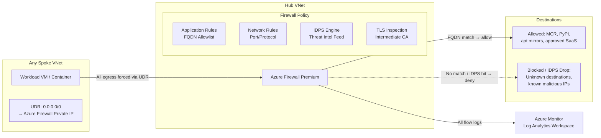

# ADR-205007: North-South Egress Inspection

| Field | Value |
|---|---|
| **ID** | ADR-205007 |
| **Status** | Accepted |
| **Provider** | Microsoft Azure |
| **Discipline** | Networking |
| **Replaces** | ADF-013 |
| **Date** | 2026-06-17 |

---

## Context

Outbound (egress) traffic from Azure workloads to the internet is a primary vector for data exfiltration and command-and-control (C2) communication. Without centralized egress inspection, individual workloads can initiate outbound connections to arbitrary internet destinations, and there is no visibility into or control over what data leaves the environment.

By default, Azure VMs and container workloads egress through a shared SNAT infrastructure with no inspection, logging, or filtering capability.

---

## Decision

All outbound internet traffic from spoke VNets will be routed through **Azure Firewall Premium** in the hub VNet via **User Defined Routes (UDRs)**. The firewall enforces:

- **FQDN-based application rules** — allowlist of approved internet destinations (OS update mirrors, container registries, SaaS APIs)
- **Network rules** — for non-HTTP/S protocols requiring explicit port/protocol allowance
- **IDPS signatures** — detect and block known threat signatures on egress traffic
- **TLS inspection** — decrypt and inspect encrypted egress for hidden exfiltration

---

## Drivers

- Prevent data exfiltration to unknown internet destinations
- Detect C2 beaconing and malware callbacks via IDPS
- Provide deterministic, auditable egress IP (Firewall public IP) for third-party allowlisting
- Satisfy compliance requirements for outbound traffic logging and control

## Alternatives Considered

| Alternative | Pros | Cons | Reason Rejected |
|---|---|---|---|
| NAT Gateway (no inspection) | Deterministic egress IP, low cost | No filtering, no logging beyond flow level | Insufficient — provides NAT but no security inspection |
| Third-party NVA (Check Point, Palo Alto) | Advanced threat prevention | High cost, operational complexity, requires HA pair | Disproportionate for current scale; Azure Firewall Premium covers requirements |
| No centralized egress (direct internet) | Zero infrastructure overhead | No visibility, no control, no compliance | Non-starter for enterprise security posture |

---

## Architecture

---

## FQDN Allowlist Categories

| Category | Example FQDNs |
|---|---|
| OS / Package Updates | `*.ubuntu.com`, `packages.microsoft.com`, `*.centos.org` |
| Container Registries | `mcr.microsoft.com`, `*.docker.io`, `ghcr.io` |
| Azure Services | `*.azure.com`, `*.windows.net`, `login.microsoftonline.com` |
| Monitoring / APM | `*.applicationinsights.azure.com`, `*.datadog.com` |
| Source Control | `github.com`, `*.githubusercontent.com` |

---

## Consequences

### Positive
- Single egress chokepoint — complete visibility and control over all outbound traffic
- FQDN allowlist prevents exfiltration to unknown or attacker-controlled destinations
- Deterministic egress IP simplifies third-party vendor allowlisting
- TLS inspection closes the “encrypted blind spot” for egress monitoring

### Negative / Trade-offs
- TLS inspection requires distributing a trusted root CA certificate to all workload trust stores — operational overhead
- FQDN allowlist requires ongoing maintenance as new dependencies are added to workloads
- Latency addition of 1–3ms through firewall processing

### Risks
- Certificate-pinned services (e.g., some Azure SDK endpoints) will break under TLS inspection — maintain FQDN bypass rules for affected endpoints
- Missing UDR on a newly provisioned subnet means traffic bypasses inspection silently — enforce via Azure Policy
- Azure Firewall outage causes egress blackout for all spokes — deploy in Availability Zone redundant configuration

---

## Implementation Notes

- Terraform: `azurerm_firewall_policy_rule_collection_group` with `application_rule_collection` (FQDN rules) and `network_rule_collection`
- TLS inspection: `azurerm_firewall_policy` with `tls_certificate` block pointing to Key Vault certificate
- CA cert distribution: deploy via Azure VM extension or container init container for all workload types
- Azure Policy: `Deploy UDR with default route to firewall` — audit/deny mode on spoke subnets
- Related: [[ADR-205004]] (Flow Logs), [[ADR-205006]] (East-West Segmentation)

---

## References

- [Azure Firewall forced tunneling](https://learn.microsoft.com/en-us/azure/firewall/forced-tunneling)
- [FQDN filtering in application rules](https://learn.microsoft.com/en-us/azure/firewall/fqdn-filtering-network-rules)
- [Azure Firewall TLS inspection](https://learn.microsoft.com/en-us/azure/firewall/premium-features#tls-inspection)
