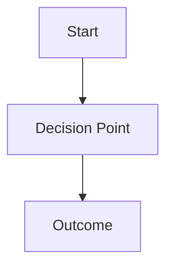

# ADR-[ID]: [Short Title]

| Field | Value |
|---|---|
| **ID** | ADR-[ID] |
| **Status** | `Draft` / `Proposed` / `Accepted` / `Deprecated` / `Superseded by ADR-XXXXXX` |
| **Provider** | Azure / AWS / GCP |
| **Discipline** | Operations / Reliability / FinOps / Security / Networking |
| **Author** | |
| **Date** | YYYY-MM-DD |
| **Reviewed By** | |

---

## Context

> Describe the forces at play — the technical, business, or organizational context that makes this decision necessary. What problem are we solving? What constraints exist?

---

## Decision

> State the decision clearly and directly. "We will..." or "We have decided to..."

---

## Drivers

- Driver 1
- Driver 2

## Alternatives Considered

| Alternative | Pros | Cons | Reason Rejected |
|---|---|---|---|
| Option A | | | |
| Option B | | | |

---

## Architecture Diagram

---

## Consequences

### Positive
- 

### Negative / Trade-offs
- 

### Risks
- 

---

## Implementation Notes

> Any follow-on tasks, linked PRs, Terraform modules, or runbook references.

---

## References

- 
